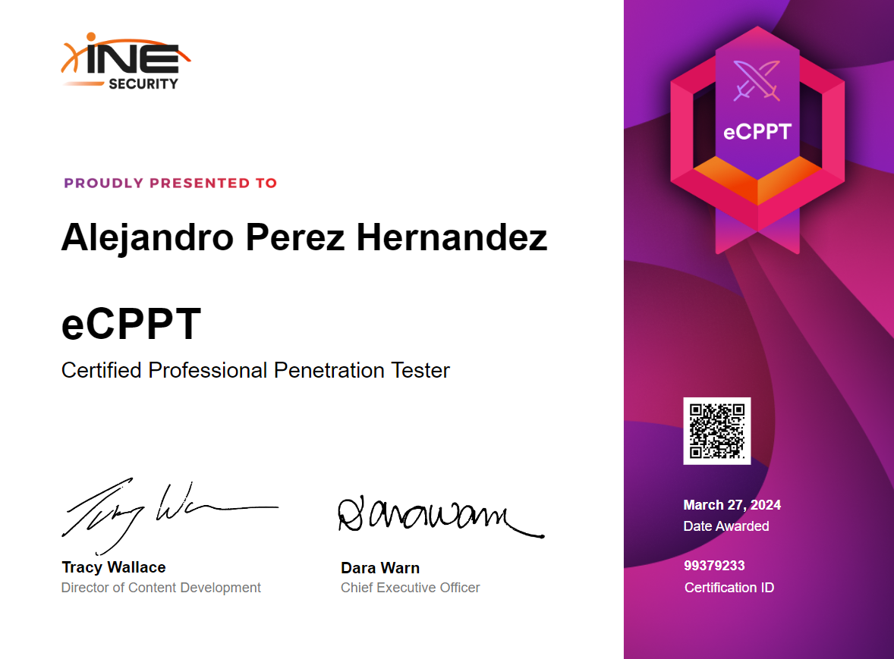

## INTRODUCCTION

This post aims to share insights, tips, and details about my preparation and experience with the eCPPTv2 certification, offered by INE, formerly known as eLearnSecurity. Throughout this discussion, I'll highlight both free and paid resources that helped me prepare for and successfully pass the exam.

## INDICE

- [Introducction](#introducction)

- [My Background](#my-background)

- [Exam Experience](#exam-experience)

- [INE MATERIAL](#ine-material)

- [Tips](#tips)

- [Additional Resources](#additional-resources)

- [Conclusion](#conclusion)

## MY BACKGROUND

Some of my Background at the time was that I was graduted student from the career of cybersecurity and started around 1 year ago in the world of the CTFs as HTB and THM where at time I have resolved around 100 machines the majority retired machines because it was learning. In addition to this, I owned the eJPTv2 that I obtained 3 months before the eCPPTv2. Last but not least, I also participate in some Cybersecurity competitions as PRCDC, NCL and CyberForce.

## EXAM EXPERIENCE 

My experience with the exam was good. Honestly, I preferred this exam over the eJPT because it allowed me to use my own environment to perform the pentest. Unlike eJPT, where you must use a VM provided by them, which has limited tools, access to this exam is through a VPN file. This differs from eJPT's method of accessing the exam. Initially, the VPN might present some problems with the ciphers, but these can be resolved quickly with a Google search. As for the timeline of my exam: I started around 9 PM and spent about 40 minutes gaining entry to the first machine. The privilege escalation for this machine was straightforward, so by 10 PM, I was opening my first tunnel to access the internal network. Four hours later, I had compromised the majority of the machines and began working on the Buffer Overflow. I went to sleep and continued the second day around 3 PM. I didn’t rush because they provide seven days of lab access. My next step was to compromise the last machine, the secret server. This took more time because I hadn’t conducted thorough enough enumeration on the machines I had already compromised. So, my first tip is: thoroughly enumerate the system, even if you have already compromised it. You need to find files or information that will help you compromise the next computer. After further enumeration of the previously compromised machines, I gained access to the last computer and began the reporting phase. Writing the report took me around six days, and it ended up being about 70 pages. I opted to use LaTeX instead of Word to enhance the presentation.

The time to receive the exam results was about 20 days; it can be a long wait, so try not to get too anxious. However, results could also arrive the next day or week. Important points to note about the exam include:

- Metasploit is allowed: I didn’t use it, as I prefer more traditional tools like chisel and socat, but it can significantly save time when pivoting around the network.
- SQLMap is allowed: I recommend using it for a better presentation of data if you encounter an SQL injection.
- Documentation: Make sure to document each step you take during the exam and take screenshots. This will significantly ease the reporting phase.

## INE MATERIAL

The training provided by INE was not to my liking, and I didn’t spend much time on it while preparing for the exam. Much of the course content was delivered through slides, which I found frustrating because I had hoped for a training experience similar to eJPTv2, which offered hands-on labs and videos that greatly aided my study for the certification. In this case, I would not recommend the course for its price, considering it is only available through an annual subscription costing around $900. While this subscription grants access to more courses, if you are only preparing for this particular certification, I suggest considering other resources, which I will mention later.
 
## TIPS

The exam is not overly difficult; however, it does require a well-understood methodology for pivoting around a network. The machines in the lab environment are similar to those found on platforms like THM and HTB. If you've solved a few machines on these platforms, you can apply similar methodologies. It's important to remember that this is not a CTF; maintain a practical approach and focus on identifying misconfigurations and exploiting technology versions rather than looking for hidden clues like passwords in images. This is a simulated small corporate network environment. Below, I will provide a list of machines that I used as reference to prepare for this exam.

### Important Points to Mention: 

- Methodology: Ensure you have a solid grasp of RECON, Enumeration, Exploitation, Post-Exploitation, and Reporting. Understanding these phases will help you navigate the exam smoothly.

- Documentation: Take detailed notes and screenshots throughout. For note-taking, consider tools like Obsidian, CherryTree, or Notion. For capturing screenshots, tools like FlameShot or Greenshot are recommended.

- Network Mapping: If you're manually pivoting with tools like chisel and proxychains, it's helpful to create a network map of the machines. Excalidraw is a free resource that integrates well with Obsidian and can assist in this process.

- Use of Automation Tools: While tools like Metasploit modules or SQLMap are available, I suggest attempting manual exploitation first. If you find yourself stuck, then consider using these tools.

- Pacing: Don’t worry if you don’t make significant progress on the first day. You have seven days to complete the exam, so take your time, and if you're stuck, use the opportunity to learn something new.

## Additional Resources

The choice of additional resources will depend on individual preferences and budget. I highly recommend purchasing a VIP subscription to HTB or TryHackMe for practice. If you’re unable to afford these subscriptions, VulnHub is an excellent alternative, though it requires a robust PC to virtualize 2-3 machines simultaneously. For practicing pivoting techniques, setting up your own labs using VulnHub machines is highly effective.

Additionally, mastering Buffer Overflow is crucial for the exam. To prepare for this part, I spent time on TryHackMe, specifically on the walkthrough called Buffer Pre, which is accessible for free. In addition, I recommend to take a look to the series of videos of The Cyber Mentor on Youtube that can give some introduccion to the BFOs.

### HTB Machines:

- [Lame](https://app.hackthebox.com/machines/1){:target="_blank"}

- [Blue](https://app.hackthebox.com/machines/51){:target="_blank"}

- [Anubis](https://app.hackthebox.com/machines/371){:target="_blank"}

- [Legacy](https://app.hackthebox.com/machines/2){:target="_blank"}

- [SolidState](https://app.hackthebox.com/machines/85){:target="_blank"}

- [Reddish](https://app.hackthebox.com/machines/147){:target="_blank"}

- [Nibbles](https://app.hackthebox.com/machines/121){:target="_blank"}

### THM Machines:

- [Buffer Overflow Prep](https://tryhackme.com/r/room/bufferoverflowprep){:target="_blank"}

- [Brainpan 1](https://tryhackme.com/r/room/brainpan){:target="_blank"}

## CONCLUSION

From my perspective, the eCPPTv2 certification is an excellent opportunity to practice pivoting techniques and exploit buffer overflows (BFO). Initially, I was somewhat intimidated, knowing it would be more challenging than the eJPT, especially in terms of pivoting. However, I ended up thoroughly enjoying the experience. It would be beneficial if INE could update the exam to address the use of outdated technology versions, as these can sometimes lead to unintended methods of entry. Aside from this, it was incredibly gratifying to succeed, enjoy the process, and further hone my reporting skills through practical application.

